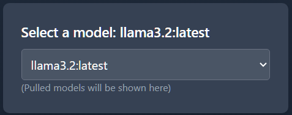

# Ollama and OpenAI
This app allows you to chat directly with the local models downloaded with Ollama in the web browser.

## Ollama: Local Large Language Models (LLMs)
Ollama is a powerful tool for running and managing open-source large language models (LLMs) on your local machine. It simplifies the setup process, allowing you to experiment with models like Llama 2, Mistral, and many others without needing a complex environment.


## Installation
### Step 1: Download Ollama
Ollama is available for all major platforms. Choose your operating system and follow the instructions below.

Download the [installer](https://ollama.com/download) from the official Ollama website.

### Step 2: Pull models
In your terminal run the command ```ollama pull llama3.2```.

Check out the Ollama model [library](https://ollama.com/library) for list of latest LLMs.

### Step 3: Run the node app in terminal
In ```/ollamachat``` directory, run ```npm run dev``` and follow the link to your browser.

# How to use
## Select LLM model

Download models from the Ollama LLM [repository](https://ollama.com/library).
If no model is downloaded, no options will be available to be selected. 

## Choose some template options to start chatting with the local model.


## Or start typing in the chat box to make your own conversation.
